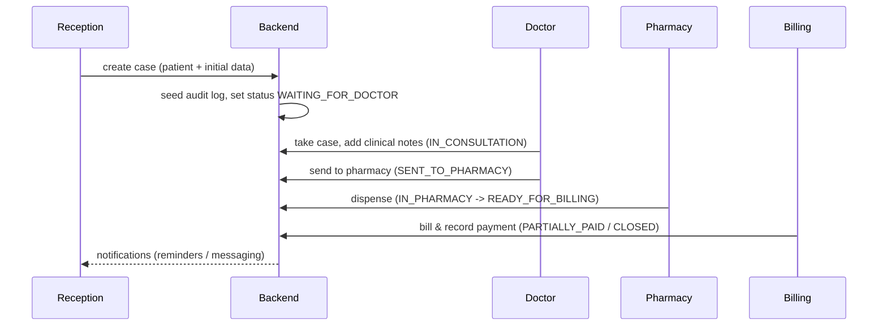

# Sparsa Homeoclinic

Enterprise README — setup, architecture, diagrams, and operational runbook

This document is an operator- and developer-focused guide for the Sparsa Homeoclinic codebase. It contains step-by-step setup/run instructions, architecture diagrams, testing & CI guidance, troubleshooting tips, and recommended operational practices for enterprise deployments.

Table of contents
- Project overview
- Architecture & data flow (diagrams)
- Case workflow (sequence)
- Prerequisites
- Backend: install, run, seed, test
- Frontend: install, run, build, test
- Environment variables & secrets
- CI / Testing / Linting
- Deployment guidance (production notes)
- Troubleshooting
- Contributing & contacts

**Project overview**

Sparsa Homeoclinic is a two-tier web application:
- Frontend: React application (CRA + Tailwind + Radix UI components) located in [frontend](frontend).
- Backend: FastAPI async service (Motor + MongoDB) located in [backend](backend).

Key backend responsibilities:
- Authentication & RBAC (JWT)
- Patient, Case, Prescription, Pharmacy workflows
- File attachments via emergent object storage
- Messaging integrations (Twilio / WhatsApp)
- Scheduled reminders

**Architecture & data flow**

High-level flow:

```mermaid
flowchart LR
	Client[Client Browser / Mobile]
	Client -->|HTTP(S)| Frontend[React Frontend]
	Frontend -->|API calls| Backend[FastAPI Backend]
	Backend -->|async| Mongo[(MongoDB)]
	Backend -->|Object Storage| Storage[(Emergent Object Storage)]
	Backend -->|External APIs| Ext[Twilio / WhatsApp / Payment]
	Backend -->|Background Jobs| Scheduler[(APScheduler / Async tasks)]
	note right of Backend: Auth (JWT), RBAC, Audit logs
```

Files to inspect for internals:
- Backend entrypoint: [backend/server.py](backend/server.py#L1-L200)
- Core infra and auth: [backend/core.py](backend/core.py#L1-L200)
- Dependency list: [backend/requirements.txt](backend/requirements.txt#L1-L50)
- Frontend root: [frontend/package.json](frontend/package.json#L1-L80)

**Case workflow (sequence)**

This is the typical lifecycle of a case in the system.



**Prerequisites**

- Linux/macOS/Windows with WSL
- Python 3.11+ (recommended) and pip
- Node.js 18+ and Yarn 1.22.x (project uses Yarn)
- MongoDB instance (local or Atlas) accessible via `MONGO_URL`
- Optional: Emergent Object Storage credentials for attachments, Twilio credentials for messaging

Local dev ports (defaults used by project):
- Backend: 8000 (uvicorn)
- Frontend: 3000 (CRA / craco)

**Backend — setup & run (development)**

1. Create a virtual environment and install dependencies

```bash
cd backend
python3 -m venv .venv
source .venv/bin/activate
pip install -r requirements.txt
```

2. Provide environment variables. Create `backend/.env` with at minimum:

```bash
MONGO_URL="mongodb://localhost:27017"
DB_NAME="sparsa_homeoclinic"
JWT_SECRET="<secure-random-value>"
# Optional but recommended for integrations:
WHATSAPP_ACCESS_TOKEN="..."
WHATSAPP_PHONE_NUMBER_ID="..."
TWILIO_ACCOUNT_SID="..."
TWILIO_AUTH_TOKEN="..."
EMERGENT_API_KEY="..."
EMERGENT_BUCKET="..."
```

3. Seed demo data (server startup will call seed_all automatically, but you can run manually)

```bash
python seed.py
```

4. Run dev server (reloads on change)

```bash
uvicorn server:app --reload --host 0.0.0.0 --port 8000
```

5. Health check

```bash
curl http://localhost:8000/api/health
```

**Frontend — setup & run (development)**

1. Install and start

```bash
cd frontend
yarn install
yarn start
```

2. Build for production

```bash
yarn build
```

3. Tests

```bash
cd backend && pytest -v
cd frontend && yarn test
```

**Environment variables & secrets (summary)**

- `MONGO_URL` — MongoDB connection string (required)
- `DB_NAME` — Database name (required)
- `JWT_SECRET` — Secret used for JWT signing (required)
- Messaging keys: `WHATSAPP_ACCESS_TOKEN`, `WHATSAPP_PHONE_NUMBER_ID`, `TWILIO_*`
- Object storage: `EMERGENT_API_KEY`, `EMERGENT_BUCKET`

Keep secrets in a secret manager or environment-specific encrypted store in production.

**Testing, Linting & Quality**

- Backend unit/integration tests: `cd backend && pytest`
- Format & lint (backend):

```bash
cd backend
black .
isort .
flake8 .
mypy .
```

- Frontend tests: `cd frontend && yarn test`

CI recommendations:
- Run `pytest` (backend) and `yarn test` (frontend) on PRs
- Run linters & type checks as separate CI stages
- Build frontend artifact and run a lightweight integration smoke test against the backend test instance

**Deployment guidance (production)**

- Run the backend behind a process manager (systemd) or container orchestrator (Docker + Kubernetes). Use an ASGI server (uvicorn/gunicorn with uvicorn workers) and a reverse proxy (NGINX) for TLS and static file serving.
- Serve the built frontend as static assets from an S3-like storage or via NGINX.
- Use environment-specific secrets (Vault/Secrets Manager) for `JWT_SECRET` and API keys.
- Ensure MongoDB is production-grade: backups, monitoring, user ACLs, TLS.

Example minimal systemd/production uvicorn command:

```bash
# run inside the backend virtualenv or container
gunicorn -k uvicorn.workers.UvicornWorker server:app -b 0.0.0.0:8000 --workers 4
```

**Operational runbook / troubleshooting**

- Error: `KeyError` on startup for `MONGO_URL` or `DB_NAME` — create `backend/.env` or export env vars.
- Error: Mongo connection refused — ensure Mongo is running and `MONGO_URL` host/port are reachable.
- Auth failures — verify `JWT_SECRET` matches across services or sessions; tokens are set as secure, httponly cookies.
- File uploads failing — check Emergent storage credentials and `storage.py` initialization logs.
- Messaging failures — check Twilio/WhatsApp tokens; logs appear at server startup (`refresh_messaging_cache`).

Logs & monitoring
- Backend logs are configured with Python `logging`. Configure structured logging or integrate with a logging pipeline (ELK, Datadog).
- Add health-checks and readiness endpoints for orchestration. The project exposes `/api/health`.

**Security & compliance notes**

- Cookies are set as `httponly` and `secure` where used. Review CORS and cookie policies if deploying behind different domains.
- Rotate `JWT_SECRET` carefully — tokens may become invalid on rotation; consider token revocation strategies.

**Useful files & pointers**
- API entrypoint: [backend/server.py](backend/server.py#L1-L200)
- Core infra & role constants: [backend/core.py](backend/core.py#L1-L200)
- Routers: [backend/routers](backend/routers)
- Frontend scripts: [frontend/package.json](frontend/package.json#L1-L80)
- Seed data: [backend/seed.py](backend/seed.py#L1-L200)

**Contributing & contact**

- Run tests and linters before opening PRs.
- Format code with `black` and `isort` for backend; keep frontend styles consistent with Tailwind conventions.
- For high-priority incidents, contact the on-call owner listed in your internal directory. Add a pointer here when available.

---

If you'd like, I can also:
- Add a lightweight `docker-compose.yml` for local dev (Mongo + backend + frontend static), or
- Create a GitHub Actions CI workflow that runs tests and linters on PRs.

View the updated README at the workspace root.
